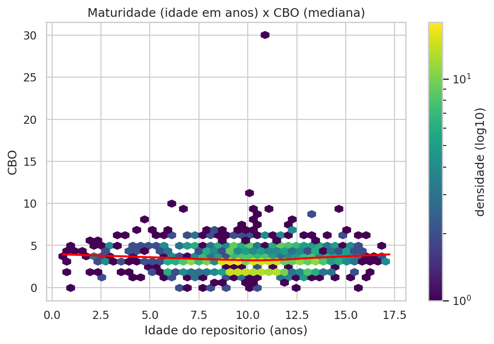
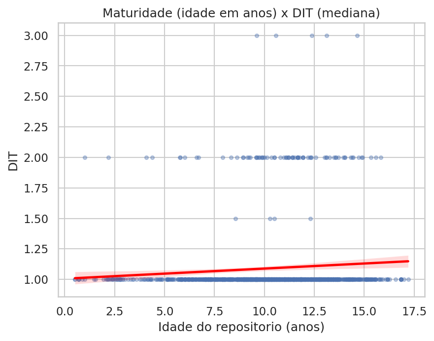
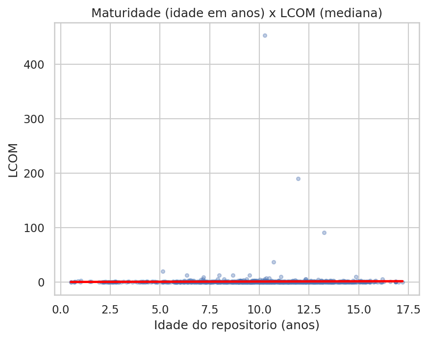

# Caracterização dos 1.000 Repositórios Java Mais Populares do GitHub: Um Estudo Empírico Observacional sobre Qualidade de Código

# 1 Introdução

## 1.1 Contextualização

O desenvolvimento de sistemas de código aberto (open-source) em Java permanece um dos pilares da engenharia de software moderna. A linguagem Java, presente em ecossistemas corporativos, frameworks de grande adoção (Spring, Hibernate, Apache) e aplicações Android, acumula décadas de projetos relevantes no GitHub. Compreender as características estruturais desses projetos — por meio de métricas objetivas de qualidade de código — oferece uma janela empírica sobre como sistemas de grande popularidade são efetivamente mantidos e evoluem ao longo do tempo.

## 1.2 Problema foco do experimento

O problema central consiste em investigar se há relação entre características observáveis dos repositórios Java (popularidade, maturidade, atividade e tamanho) e a qualidade estrutural de seus códigos-fonte, mensurada pelas métricas CK. Busca-se entender se projetos mais populares, mais antigos, mais ativos ou maiores tendem a apresentar melhores (ou piores) indicadores de acoplamento, profundidade de herança e coesão interna.

## 1.3 Questões de Pesquisa

O estudo é guiado pelas seguintes questões de pesquisa (RQs):

- **RQ 01:** Qual a relação entre a **popularidade** dos repositórios e as suas características de qualidade?
- **RQ 02:** Qual a relação entre a **maturidade** do repositório e as suas características de qualidade?
- **RQ 03:** Qual a relação entre a **atividade** dos repositórios e as suas características de qualidade?
- **RQ 04:** Qual a relação entre o **tamanho** dos repositórios e as suas características de qualidade?

## 1.4 Hipóteses

Com base na observação empírica do ecossistema open-source Java, foram formuladas as seguintes hipóteses:

**Grupo A — Popularidade (RQ01)**

Repositórios mais populares tenderiam a ter:

- menor acoplamento (CBO), pois recebem mais revisão da comunidade.
- menor profundidade de herança (DIT), por priorizarem manutenção mais simples.
- menor falta de coesão (LCOM), por terem organização interna melhor.

**Grupo B — Maturidade (RQ02)**

Repositórios mais maduros tenderiam a ter:

- menor CBO, por acumularem refatorações ao longo do tempo.
- menor DIT, por priorizarem manutenção mais simples.
- menor LCOM, por evoluírem com melhor organização interna.

**Grupo C — Atividade (RQ03)**

Repositórios com mais releases tenderiam a ter:

- menor CBO, por manterem ciclos de evolução e revisão mais frequentes.
- menor DIT, por priorizarem estruturas mais simples para manutenção.
- menor LCOM, por acumularem melhorias internas ao longo do tempo.

**Grupo D — Tamanho (RQ04)**

Repositórios com maior LOC tenderiam a ter:

- maior CBO.
- maior DIT.
- maior LCOM.

## 1.5 Objetivo (principal e específicos)

**Objetivo principal:** Coletar e analisar métricas de qualidade estrutural dos 1.000 repositórios Java com maior número de estrelas no GitHub, correlacionando-as com características do processo de desenvolvimento, para caracterizar e compreender padrões de qualidade em projetos open-source populares.

**Objetivos específicos:**

1. Implementar um script de mineração de dados utilizando a API GraphQL do GitHub para coleta automatizada de métricas de processo.
2. Executar a ferramenta CK sobre os repositórios coletados para obtenção das métricas de produto (CBO, DIT, LCOM).
3. Agregar as métricas CK em nível de repositório (média, mediana, desvio padrão).
4. Calcular correlações de Pearson e Spearman entre variáveis de processo e métricas de qualidade.
5. Confrontar os resultados com as hipóteses iniciais.

---

# 2 Metodologia

Este trabalho caracteriza-se como um estudo empírico observacional, com análise quantitativa descritiva de repositórios Java hospedados no GitHub. A estratégia adotada concentrou-se na extração automatizada de dados públicos por meio da API GraphQL do GitHub e na análise estática de código-fonte via ferramenta CK, seguidas de análise estatística correlacional.

## 2.1 Passo a passo do experimento

O experimento foi executado nas seguintes etapas sequenciais:

**Etapa 1 — Definição das questões de pesquisa:** Foram estabelecidas quatro questões de pesquisa (RQ01–RQ04), cada uma associada a uma característica observável do repositório (popularidade, maturidade, atividade e tamanho) e às métricas CK de qualidade estrutural.

**Etapa 2 — Construção e execução da coleta GraphQL:** Foi elaborada a consulta GraphQL com foco nos repositórios Java mais populares da plataforma, incluindo atributos como nome, URL, data de criação (`createdAt`), número de estrelas (`stargazerCount`) e número de releases (`releasesCount`). Em seguida, o programa realizou a coleta paginada dos 1.000 repositórios, consolidou os registros e exportou os dados de processo para `data/repositories.csv`, incluindo o campo `age` calculado em tempo de coleta.

**Etapa 3 — Clonagem e análise CK:** Cada repositório é clonado com e submetido à ferramenta CK (via subprocesso Java), que gera métricas por classe.

**Etapa 4 — Sumarização por repositório:** As métricas CK geradas em nível de classe são agregadas por repositório (média, mediana e desvio padrão de CBO, DIT e LCOM), resultando em um dataset analítico com um registro por repositório.

**Etapa 5 — Análise estatística e geração de visualizações:** A partir do dataset sumarizado, scripts de análise calculam correlações de Pearson e Spearman (com p-valores) entre variáveis de processo e métricas de qualidade, e geram diagramas de dispersão para cada RQ.

**Etapa 6 - Interpretação dos resultados:** Os resultados quantitativos são interpretados à luz das hipóteses formuladas, discutindo-se as implicações práticas e teóricas.

## 2.2 Decisões

Durante a execução do experimento, as seguintes decisões metodológicas e técnicas foram tomadas:

| Decisão | Justificativa |
|---------|---------------|
| **Clone superficial (`--depth 1`)** | CK necessita apenas dos arquivos-fonte, não do histórico de commits; economiza disco e tempo. |
| **Flag `ckMetricsGenerated`** | Permite retomada de execuções interrompidas sem reprocessar repositórios já concluídos. |
| **Tratamento de `ckMetrics.csv` vazio** | Repositórios retornados por `language:Java` podem não ter arquivos `.java` no branch padrão; nesses casos o CK gera apenas cabeçalho, então o repositório é marcado como não analisável (`ckMetricsGenerated=false`) e excluído das correlações. |
| **Paralelismo padrão = 3** | 10 instâncias JVM simultâneas causavam OOM em máquinas com ≤ 16 GB RAM; 3 é o equilíbrio seguro entre velocidade e estabilidade. |
| **Heap JVM limitado (`-Xmx2g`)** | Evita crescimento ilimitado de memória quando múltiplas instâncias CK rodam em paralelo. |
| **`max-files-per-partition = 500`** | Evita OOM ao processar repositórios muito grandes (Elasticsearch, Kafka) ao particionar a análise em lotes de 500 arquivos. |

## 2.3 Materiais utilizados

- **Plataforma GitHub** como fonte dos dados observados.
- **API GraphQL do GitHub** para consulta estruturada dos repositórios Java.
- **Ferramenta CK** (`source-code-ck/ck`) para geração de métricas de produto em nível de classe.
- **Linguagem Python** para automação da coleta, clonagem, execução do CK e análise estatística.
- Bibliotecas **`requests`**, **`python-dotenv`**, **`pandas`**, **`scipy`** e **`matplotlib`**.
- Consulta GraphQL (`src/github_query.graphql`).
- Scripts de coleta e análise (`src/`).
- Arquivo CSV de saída (`data/repositories.csv`).

## 2.4 Métodos utilizados

Foi utilizado o método de **Mineração de Repositórios de Software (MSR — Mining Software Repositories)** aliado à análise estática de código-fonte pela ferramenta CK.

Para a análise quantitativa, adotou-se **estatística correlacional**: para cada par (variável de processo × métrica de qualidade), foram calculados os coeficientes de **Correlação de Pearson** (relação linear) e **Correlação de Spearman** (relação monotônica, robusta a assimetria e outliers), acompanhados dos respectivos **p-valores** (nível de significância adotado: 5%).

A sumarização das métricas CK em nível de classe utiliza a **mediana** como medida de tendência central (robusta a outliers), complementada por **média** e **desvio padrão** para caracterização da distribuição.

## 2.5 Métricas e suas Unidades

As métricas observadas no experimento foram definidas a partir das questões de pesquisa. O quadro a seguir sintetiza cada métrica, sua descrição operacional e unidade de medida.

**Métricas de processo (GitHub API):**

| Questão | Métrica | Descrição operacional | Unidade |
|---------|---------|----------------------|---------|
| RQ01 | Popularidade | `stargazerCount` — número de estrelas do repositório | contagem (inteiro) |
| RQ02 | Maturidade | `age_years = age / 365.25` — idade do repositório em anos | anos |
| RQ03 | Atividade | `releasesCount` — número total de releases no GitHub | contagem (inteiro) |
| RQ04 | Tamanho | `total_loc` — soma de linhas de código (LOC) por classe | linhas |

**Métricas de produto (CK Tool):**

| Métrica | Descrição | Interpretação |
|---------|-----------|---------------|
| **CBO** (Coupling Between Objects) | Acoplamento entre classes | Quanto maior, mais dependências; maior dificuldade de manutenção |
| **DIT** (Depth of Inheritance Tree) | Profundidade da hierarquia de herança | Quanto maior, mais níveis na hierarquia |
| **LCOM** (Lack of Cohesion of Methods) | Falta de coesão interna da classe | Quanto maior, pior a coesão entre métodos |

---

# 3 Resultados e Discussão

Os resultados desta seção foram consolidados a partir de **960 repositórios** com métricas CK válidas (`ckMetricsGenerated=true` e `ckMetrics.csv` com dados de classe). A sumarização CK em nível de repositório utiliza a mediana por repositório (`cbo_median`, `dit_median`, `lcom_median`) como variável dependente nas correlações.

**Medidas centrais das métricas CK (entre repositórios):**

| Métrica | Estatística por repositório | n | Média | Mediana | Desvio padrão |
|---------|----------------------------|---|-------|---------|---------------|
| CBO | mean | 960 | 5,341 | 5,276 | 1,870 |
| CBO | median | 960 | 3,537 | 3,000 | 1,729 |
| CBO | std | 951 | 6,251 | 6,010 | 2,624 |
| DIT | mean | 960 | 1,451 | 1,388 | 0,344 |
| DIT | median | 960 | 1,090 | 1,000 | 0,302 |
| DIT | std | 951 | 1,057 | 0,769 | 2,178 |
| LCOM | mean | 960 | 116,067 | 23,667 | 1765,281 |
| LCOM | median | 960 | 1,469 | 0,000 | 16,210 |
| LCOM | std | 951 | 3282,152 | 130,036 | 76753,979 |

#### Repositórios excluídos da análise CK (n = 40)

Dos 1.000 repositórios coletados, **40 foram excluídos** da análise estatística por não possuírem métricas CK válidas.

- **8 repositórios**: sem arquivos `.java` no branch padrão (CK gera apenas cabeçalho).
- **19 repositórios**: timeout na rerodagem CK focada (`--ck-timeout 180`).
- **13 repositórios**: erro de execução CK (`exit 1`, sem timeout explícito).

**Sem arquivos `.java` no branch padrão (n = 8)**

| Repositório |
|---|
| `hollischuang/toBeTopJavaer` |
| `frank-lam/fullstack-tutorial` |
| `react-native-camera/react-native-camera` |
| `CoderLeixiaoshuai/java-eight-part` |
| `Archmage83/tvapk` |
| `RedSpider1/concurrent` |
| `jlegewie/zotfile` |
| `NotFound9/interviewGuide` |

**Timeout na rerodagem CK (`--ck-timeout 180`) (n = 19)**

| Repositório |
|---|
| `elastic/elasticsearch` |
| `openjdk/jdk` |
| `google/ExoPlayer` |
| `oracle/graal` |
| `apache/shardingsphere` |
| `JetBrains/intellij-community` |
| `Grasscutters/Grasscutter` |
| `prestodb/presto` |
| `quarkusio/quarkus` |
| `apache/hadoop` |
| `projectlombok/lombok` |
| `checkstyle/checkstyle` |
| `facebook/buck` |
| `hazelcast/hazelcast` |
| `haifengl/smile` |
| `vavr-io/vavr` |
| `dragonwell-project/dragonwell8` |
| `aws/aws-sdk-java` |
| `kubernetes-client/java` |

**Erro de execução CK (`exit 1`) na rerodagem (n = 13)**

| Repositório |
|---|
| `NationalSecurityAgency/ghidra` |
| `dbeaver/dbeaver` |
| `Anuken/Mindustry` |
| `kestra-io/kestra` |
| `thingsboard/thingsboard` |
| `openzipkin/zipkin` |
| `questdb/questdb` |
| `neo4j/neo4j` |
| `provectus/kafka-ui` |
| `aosp-mirror/platform_frameworks_base` |
| `google/j2objc` |
| `apache/groovy` |
| `JabRef/jabref` |

---

### 3.1 RQ01 — Qual a relação entre a popularidade dos repositórios e as suas características de qualidade?

A análise de correlação entre número de estrelas (`stargazerCount`) e métricas CK indica que a popularidade não é um preditor forte de qualidade estrutural. Nenhum dos três coeficientes atingiu magnitude relevante, sugerindo que projetos muito estrelados não apresentam, sistematicamente, melhor nem pior qualidade estrutural nas dimensões avaliadas.

#### Correlações — RQ01

| Métrica | Pearson | p-valor (Pearson) | Spearman | p-valor (Spearman) | n |
|---------|--------:|------------------:|---------:|-------------------:|--:|
| CBO | -0,1020 | 0,0015 | 0,0312 | 0,3348 | 960 |
| DIT | -0,0498 | 0,1233 | -0,0333 | 0,3034 | 960 |
| LCOM | -0,0210 | 0,5154 | 0,0129 | 0,6893 | 960 |

Considerando nível de significância de 5%, apenas o p-valor de Pearson para CBO ficou abaixo desse limite. Mesmo assim, o coeficiente é pequeno em magnitude (-0,1020), indicando efeito fraco.

#### Visualizações — RQ01

*Fig. 1: Relação entre popularidade (log10 de estrelas) e CBO. A linha de tendência apresenta leve inclinação negativa, porém com efeito fraco.*

*Fig. 2: Relação entre popularidade e DIT. A linha de tendência está praticamente horizontal, indicando ausência de relação relevante.*

*Fig. 3: Relação entre popularidade e LCOM. Alta dispersão e outliers; tendência geral fraca.*

*Leitura da escala log da popularidade:* `log10(stars)=3` ≈ 1 mil estrelas, `4` ≈ 10 mil, `5` ≈ 100 mil.

#### Discussão — RQ01

**Confronto com hipóteses H1, H2, H3:** As três hipóteses previam que repositórios mais populares apresentariam menor acoplamento, menor profundidade de herança e menor falta de coesão. Os dados **não confirmam** essas hipóteses: os coeficientes ficaram muito próximos de zero para as três métricas, e apenas CBO apresentou significância estatística, ainda assim com efeito de magnitude pequena.

> **Hipótese:** esperado = "mais estrelas -> menor CBO/DIT/LCOM"; observado = efeitos praticamente nulos (com CBO apenas levemente negativo); **status = hipóteses rejeitadas**.

Na prática, os resultados sugerem que, nesta amostra, a popularidade medida por estrelas não explica a qualidade estrutural do código Java. Esse resultado pode ser explicado pela diversidade do ecossistema Java: repositórios muito estrelados incluem desde frameworks corporativos complexos (com alto CBO por design arquitetural) até bibliotecas utilitárias altamente coesas, e esse espectro apaga qualquer tendência sistemática.

---

### 3.2 RQ02 — Qual a relação entre a maturidade do repositório e as suas características de qualidade?

A análise de correlação entre maturidade (idade em anos) e métricas CK revela associações também fracas, com DIT e LCOM apresentando sinais positivos — contrário ao esperado pelas hipóteses.

#### Correlações — RQ02

| Métrica | Pearson | p-valor (Pearson) | Spearman | p-valor (Spearman) | n |
|---------|--------:|------------------:|---------:|-------------------:|--:|
| CBO | 0,0075 | 0,8165 | 0,0212 | 0,5126 | 960 |
| DIT | 0,0870 | 0,0070 | 0,0959 | 0,0029 | 960 |
| LCOM | 0,0151 | 0,6399 | 0,0825 | 0,0105 | 960 |

Considerando nível de significância de 5%:

- DIT apresentou associação positiva fraca com maturidade em Pearson e Spearman (ambos significativos).
- LCOM apresentou associação positiva fraca apenas em Spearman.
- CBO não apresentou evidência estatística de associação.

#### Visualizações — RQ02

*Fig. 4: Relação entre maturidade (anos) e CBO. Linha de tendência praticamente horizontal.*

*Fig. 5: Relação entre maturidade e DIT. Leve inclinação positiva, consistente com correlações fracas mas significativas.*

*Fig. 6: Relação entre maturidade e LCOM. Tendência discretamente positiva, com alta dispersão e outliers.*

#### Discussão — RQ02

**Confronto com hipóteses H4, H5, H6:** As três hipóteses previam que repositórios mais maduros apresentariam menor CBO, DIT e LCOM — fruto de refatorações acumuladas. Os dados **não confirmam** essas hipóteses. Para DIT e LCOM, os sinais observados foram positivos (ou seja, repositórios mais antigos tendem a ter DIT e LCOM ligeiramente maiores), embora com efeito fraco.

> **Hipótese:** esperado = "mais idade -> menor CBO/DIT/LCOM"; observado = CBO nulo e leve aumento de DIT/LCOM com maturidade; **status = hipóteses rejeitadas (sinal oposto em parte dos indicadores)**.

Uma explicação plausível: repositórios mais antigos surgiram em uma época em que herança profunda era mais idiomática em Java (padrões de design como Abstract Factory e Template Method favorecem hierarquias). Além disso, projetos que duram mais tendem a acumular mais código legado, aumentando LCOM em partes não refatoradas.

---

### 3.3 RQ03 — Qual a relação entre a atividade dos repositórios e as suas características de qualidade?

A análise de correlação entre número de releases e métricas CK revela que CBO apresenta associação positiva fraca com atividade — contrário ao esperado.

#### Correlações — RQ03

| Métrica | Pearson | p-valor (Pearson) | Spearman | p-valor (Spearman) | n |
|---------|--------:|------------------:|---------:|-------------------:|--:|
| CBO | 0,1580 | < 0,0001 | 0,2794 | < 0,0001 | 960 |
| DIT | -0,0413 | 0,2009 | -0,0455 | 0,1592 | 960 |
| LCOM | -0,0133 | 0,6809 | 0,1091 | 0,0007 | 960 |

Considerando nível de significância de 5%:

- CBO apresentou associação positiva fraca com atividade, com significância estatística em Pearson e Spearman.
- DIT não apresentou evidência estatística de associação.
- LCOM apresentou associação monotonicamente positiva fraca apenas em Spearman.

#### Visualizações — RQ03

*Fig. 7: Relação entre atividade (log10 de releases+1) e CBO. A linha de tendência (vermelha) apresenta inclinação positiva leve, coerente com correlação fraca.*

*Fig. 8: Relação entre atividade (log10 de releases+1) e DIT. A linha de tendência (vermelha) permanece praticamente horizontal.*

*Fig. 9: Relação entre atividade (log10 de releases+1) e LCOM. Tendência positiva discreta, com efeito fraco.*

*Leitura da escala log da atividade:* `log10(releases+1)=1` ≈ 10 releases, `2` ≈ 100, `3` ≈ 1000.

#### Discussão — RQ03

**Confronto com hipóteses H7, H8, H9:** As hipóteses previam que repositórios com mais releases apresentariam menor CBO, DIT e LCOM — resultado de ciclos frequentes de revisão e melhoria. Os dados **não confirmam** essas hipóteses. Para CBO, o sinal observado é positivo: repositórios com mais releases tendem a ter CBO ligeiramente maior.

> **Hipótese:** esperado = "mais releases -> menor CBO/DIT/LCOM"; observado = CBO levemente maior e DIT sem relação clara; **status = hipóteses rejeitadas**.

Uma interpretação possível: projetos com muitas releases são frequentemente bibliotecas ou frameworks de ampla adoção, cujo design intencional envolve alto acoplamento entre módulos (ex.: Spring, Hibernate). O número de releases pode refletir popularidade da interface pública, não necessariamente qualidade interna. Para LCOM e DIT, os efeitos são ainda menores e sem padrão consistente.

---

### 3.4 RQ04 — Qual a relação entre o tamanho dos repositórios e as suas características de qualidade?

A análise de correlação entre tamanho (LOC total) e métricas CK replica o padrão das RQs anteriores: CBO apresenta a associação mais forte (ainda que fraca), enquanto DIT não apresenta associação relevante.

#### Cobertura dos dados

- Repositórios com LOC válido: 960.
- Repositórios com linhas de comentários válidas: 0 (dados não disponíveis na base consolidada CK).
- Repositórios válidos para correlações LOC × qualidade: 960.

#### Correlações — RQ04

| Variável de tamanho | Métrica | Pearson | p-valor (Pearson) | Spearman | p-valor (Spearman) | n |
|---------------------|---------|--------:|------------------:|---------:|-------------------:|--:|
| LOC | CBO | 0,1609 | < 0,0001 | 0,2906 | < 0,0001 | 960 |
| LOC | DIT | -0,0185 | 0,5678 | -0,0364 | 0,2605 | 960 |
| LOC | LCOM | 0,0195 | 0,5460 | 0,1510 | < 0,0001 | 960 |
| COMMENT\_LINES | CBO | — | — | — | — | 0 |
| COMMENT\_LINES | DIT | — | — | — | — | 0 |
| COMMENT\_LINES | LCOM | — | — | — | — | 0 |

Considerando nível de significância de 5%:

- Para LOC, CBO apresentou associação positiva fraca com significância em Pearson e Spearman.
- Para LOC, DIT não apresentou evidência estatística de associação.
- Para LOC, LCOM apresentou associação monotônica positiva fraca em Spearman.
- Para linhas de comentários, não foi possível calcular correlações (n = 0).

#### Visualizações — RQ04

*Fig. 10: Relação entre tamanho em LOC (log10) e CBO. Inclinação positiva leve, coerente com associação fraca.*

*Fig. 11: Relação entre LOC e DIT. Linha de tendência praticamente horizontal.*

*Fig. 12: Relação entre LOC e LCOM. Tendência linear fraca; em Spearman há associação monotônica fraca.*

*Leitura da escala log de LOC:* `log10(LOC+1)=3` ≈ 1 mil linhas, `4` ≈ 10 mil, `5` ≈ 100 mil.

#### Discussão — RQ04

**Confronto com hipóteses H10, H11, H12:** As hipóteses previam que repositórios maiores (maior LOC) apresentariam maior CBO, DIT e LCOM — pela maior complexidade esperada. Os dados **confirmam parcialmente** H10 (CBO) e H12 (LCOM em Spearman), mas **não confirmam** H11 (DIT permanece sem associação relevante).

> **Hipótese:** esperado = "mais LOC -> maior CBO/DIT/LCOM"; observado = aumento fraco de CBO e LCOM, sem evidência para DIT; **status = parcialmente confirmada**.

A associação positiva entre LOC e CBO é intuitiva: sistemas maiores tendem a ter mais classes interconectadas. Para LCOM, o sinal em Spearman é positivo, mas fraco, sugerindo que classes em sistemas grandes apresentam levemente menor coesão interna. DIT, por outro lado, parece não crescer com o tamanho — a profundidade da hierarquia de herança é uma decisão de design mais independente do volume de código.

Hipóteses sobre linhas de comentários (H13–H15) não puderam ser testadas por ausência de dados.

---

# 4 Insights Adicionais

## 4.1 Padrão transversal: efeitos fracos em todas as RQs

Um resultado notável é a **consistência dos efeitos fracos** ao longo de todas as quatro questões de pesquisa. Em nenhuma das combinações (variável de processo × métrica CK) foi observada uma correlação forte (|r| ≥ 0,5). A maior correlação observada foi Spearman para LOC × CBO (ρ = 0,291) e para releases × CBO (ρ = 0,279), ambas na faixa "fraca a moderada". Isso indica que **fatores do repositório como popularidade, maturidade, atividade e tamanho não explicam fortemente a qualidade estrutural** quando medida por CBO, DIT e LCOM.

## 4.2 CBO como métrica mais responsiva

Dentre as três métricas CK, CBO foi a que apresentou as correlações mais expressivas (ainda que fracas) com variáveis de processo — especialmente com LOC e número de releases. DIT mostrou ser essencialmente independente das variáveis de processo avaliadas. LCOM apresentou comportamento intermediário, com sinais em Spearman para maturidade, atividade e tamanho, mas sempre com magnitude baixa.

## 4.3 Dispersão e outliers em LCOM

LCOM é a métrica com maior variabilidade: o desvio padrão entre repositórios para LCOM médio excede 1.765, enquanto para CBO é menor que 2. Isso reflete o comportamento inerente do LCOM: uma classe com métodos completamente não relacionados pode acumular valores muito altos. A mediana de LCOM por repositório é 0,0 (valor modal), indicando que a maioria dos repositórios possui, na mediana de suas classes, coesão dentro do esperado para classes Java bem projetadas.

---

# 5 Conclusão

## 5.1 Tomada de decisão

- **Qualidade não é garantida pela popularidade:** O fato de um repositório Java acumular muitas estrelas não implica melhor qualidade estrutural nas dimensões CBO, DIT e LCOM. Equipes que avaliam dependências open-source devem realizar análise estática do código-fonte em vez de confiar apenas na popularidade como proxy de qualidade.

- **Projetos maduros requerem atenção à dívida técnica:** A associação positiva (embora fraca) entre maturidade e DIT sugere que hierarquias de herança tendem a crescer com o tempo. Equipes responsáveis por projetos legados em Java devem monitorar ativamente a profundidade da herança e refatorar hierarquias excessivamente profundas.

- **Sistemas maiores demandam governança de acoplamento:** A relação positiva entre LOC e CBO indica que sistemas maiores acumulam mais acoplamento. Práticas como revisão de dependências e adoção de injeção de dependência podem mitigar o crescimento não controlado de CBO.

- **Releases frequentes não garantem qualidade estrutural:** A ausência de correlação negativa entre atividade (releases) e métricas CK sugere que ciclos de entrega rápidos não necessariamente se traduzem em melhoria da qualidade estrutural. Investir em refatoração contínua e revisão de design é tão importante quanto manter cadência de releases.

## 5.2 Resultado conclusivo sucinto

Este estudo analisou os 1.000 repositórios Java mais estrelados do GitHub por meio de métricas CK (CBO, DIT, LCOM) e correlações com características de processo (popularidade, maturidade, atividade e tamanho). Os resultados mostram que, em todas as combinações avaliadas, os coeficientes de correlação foram de **magnitude fraca** (|r| < 0,30). Quando estatisticamente significativos, os efeitos foram consistentemente pequenos, não permitindo afirmar que repositórios mais populares, mais antigos, mais ativos ou maiores apresentam sistematicamente melhor qualidade estrutural em Java. A exceção parcial é o par LOC × CBO, com ρ = 0,291 em Spearman, sugerindo que sistemas maiores tendem a ser um pouco mais acoplados.