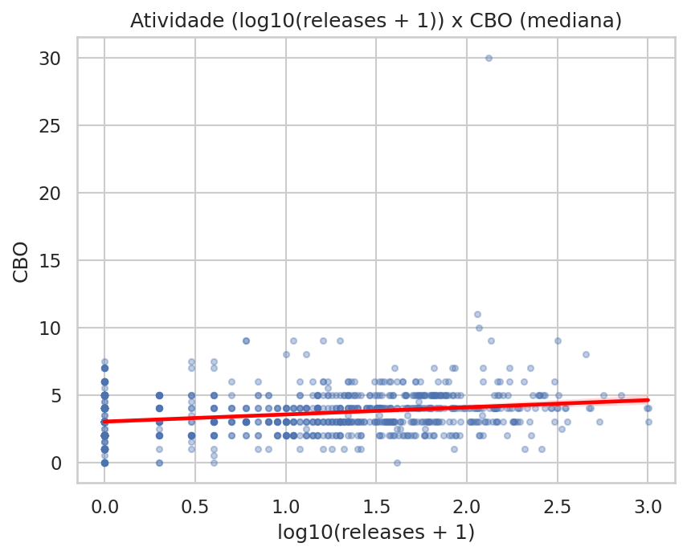
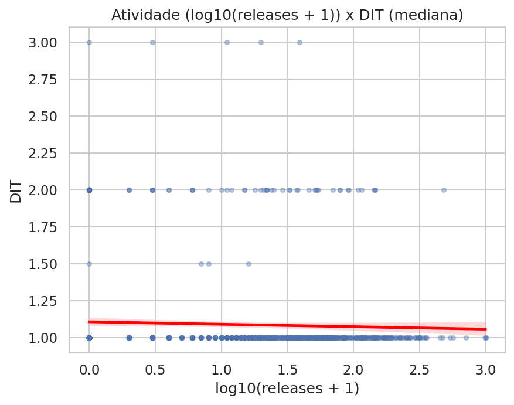
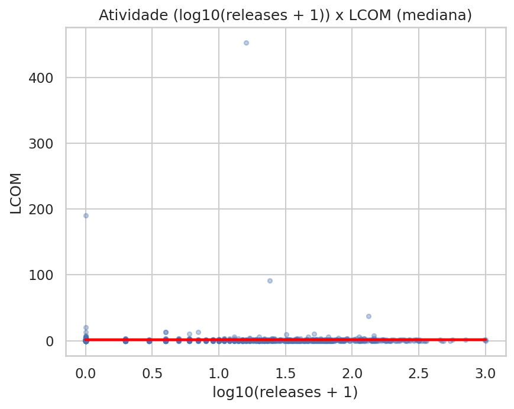

# RQ03 - Relacao entre Atividade dos Repositorios e Caracteristicas de Qualidade

## 1. Introducao e Hipoteses Informais

A RQ03 analisa se repositorios Java mais ativos (com maior numero de releases no GitHub) tendem a apresentar melhor qualidade de codigo.

Conceitos:
a. CBO: acoplamento entre classes,
b. DIT: profundidade de heranca,
c. LCOM: falta de coesao entre metodos.

Hipoteses informais adotadas antes da analise:
1. H1: Repositorios com mais releases tenderiam a ter menor acoplamento (CBO), por manterem ciclos de evolucao e revisao mais frequentes.
2. H2: Repositorios com mais releases tenderiam a ter menor profundidade de heranca (DIT), por priorizarem estruturas mais simples para manutencao.
3. H3: Repositorios com mais releases tenderiam a ter menor falta de coesao (LCOM), por acumularem melhorias internas ao longo do tempo.

## 2. Metodologia

### 2.1 Coleta e preparacao dos dados

- Fonte de atividade: `releasesCount` (GitHub API).
- Fonte de qualidade: metricas CK por classe (`cbo`, `dit`, `lcom`).
- Unidade analitica da RQ03: repositorio.

Foram usados apenas os repositorios com `ckMetricsGenerated=true`.

### 2.2 Sumarizacao por repositorio

Para cada repositorio, as metricas CK em nivel de classe foram agregadas por:

- media;
- mediana;
- desvio padrao amostral.

Esse calculo foi feito separadamente para CBO, DIT e LCOM. Assim, cada repositorio ficou com os campos:

- `<metrica>_mean`
- `<metrica>_median`
- `<metrica>_std`

O arquivo completo com essa sumarizacao por repositorio esta em:

- `assets/rq03/rq03_resumo_por_repositorio.csv`

### 2.3 Analise estatistica

- Atividade foi considerada como `releasesCount`.
- Para visualizacao, foi usada a transformacao `log10(releasesCount + 1)` no eixo X dos graficos.
- Para medir a relacao entre atividade e qualidade, foram calculadas correlacoes de Pearson e Spearman entre `releasesCount` e a **mediana por repositorio** de cada metrica (`cbo_median`, `dit_median`, `lcom_median`).
- Tambem foi calculado o p-valor de cada correlacao.

## 3. Resultados

### 3.1 Cobertura dos dados

- Repositorios no dataset consolidado da RQ03: 968.
- Repositorios com valores validos para as correlacoes (por metrica): 960.

### 3.2 Correlacoes (atividade vs mediana da metrica por repositorio)

Pense no p-valor como um "termometro de coincidencia". Ele responde: "Se nao existisse relacao nenhuma entre as coisas que estou comparando, qual seria a chance de eu ver um resultado como este so por acaso?"

> p-valor pequeno
Significa: "seria raro acontecer so por sorte".
Entao a gente comeca a acreditar que pode existir relacao de verdade.

> p-valor grande
Significa: "isso pode acontecer por sorte sem problema".
Entao nao da para afirmar que existe relacao.

| Metrica | Pearson | p-valor (Pearson) | Spearman | p-valor (Spearman) | n |
| --- | ---: | ---: | ---: | ---: | ---: |
| CBO | 0.1576 | 0.0000 | 0.2801 | 0.0000 | 960 |
| DIT | -0.0411 | 0.2032 | -0.0458 | 0.1560 | 960 |
| LCOM | -0.0131 | 0.6858 | 0.1101 | 0.0006 | 960 |

Considerando nivel de significancia de 5% (0,05):

- CBO apresentou associacao positiva fraca com atividade, com significancia estatistica em Pearson e Spearman.
- DIT nao apresentou evidencia estatistica de associacao.
- LCOM apresentou associacao monotonicamente positiva fraca em Spearman, mas sem evidencia linear em Pearson.

Mesmo nos casos com p-valor abaixo de 0,05, os coeficientes sao pequenos em magnitude, indicando efeito fraco.

**ATENCAO**
- p-valor fala de confianca contra o acaso;
- coeficiente fala de tamanho da relacao.

Arquivo CSV correspondente:

- `assets/rq03/rq03_correlacoes.csv`

### 3.3 Medidas centrais das estatisticas por repositorio

Resumo das estatisticas (media, mediana e desvio padrao) calculadas por repositorio:

| Metrica | Descricao metrica | Estatistica por repositorio | n | Media (entre repositorios) | Mediana (entre repositorios) | Desvio padrao (entre repositorios) |
| --- | --- | --- | ---: | ---: | ---: | ---: |
| CBO | Acoplamento entre classes | mean | 960 | 5.339 | 5.276 | 1.872 |
| CBO | Acoplamento entre classes | median | 960 | 3.535 | 3.000 | 1.727 |
| CBO | Acoplamento entre classes | std | 951 | 6.247 | 6.009 | 2.630 |
| DIT | Profundidade de heranca | mean | 960 | 1.451 | 1.388 | 0.343 |
| DIT | Profundidade de heranca | median | 960 | 1.090 | 1.000 | 0.302 |
| DIT | Profundidade de heranca | std | 951 | 1.058 | 0.769 | 2.178 |
| LCOM | Falta de coesao entre metodos | mean | 960 | 116.138 | 23.793 | 1765.278 |
| LCOM | Falta de coesao entre metodos | median | 960 | 1.460 | 0.000 | 16.209 |
| LCOM | Falta de coesao entre metodos | std | 951 | 3282.823 | 130.539 | 76753.952 |

### 3.4 Graficos (diagramas de dispersao)

Fig. 1: Relacao entre atividade (numero de releases, em escala log10(releases+1) no eixo X) e acoplamento entre classes (CBO). A linha vermelha apresenta inclinacao positiva, coerente com correlacoes positivas fracas para CBO.

Fig. 2: Relacao entre atividade e profundidade de heranca (DIT). A linha de tendencia aparece praticamente horizontal com leve inclinacao negativa, consistente com correlacoes fracas e nao significativas.

Fig. 3: Relacao entre atividade e falta de coesao entre metodos (LCOM). A tendencia linear e muito fraca, com alta dispersao e presenca de outliers; em Spearman ha associacao monotonicamente positiva fraca.

## 4. Discussao (Hipoteses vs Resultados)

### 4.1 Hipotese 1 (atividade vs CBO)

A expectativa de menor CBO em repositorios mais ativos nao se confirmou. As correlacoes foram positivas (Pearson = 0.1576; Spearman = 0.2801), ambas com p-valor baixo. Ainda assim, o tamanho do efeito e fraco.

### 4.2 Hipotese 2 (atividade vs DIT)

A hipotese de menor DIT em repositorios mais ativos tambem nao se confirmou. Os coeficientes ficaram proximos de zero e sem significancia estatistica (Pearson = -0.0411; Spearman = -0.0458), sugerindo ausencia de relacao consistente.

### 4.3 Hipotese 3 (atividade vs LCOM)

Para LCOM, Pearson ficou praticamente nulo (-0.0131), enquanto Spearman foi positivo e fraco (0.1101), com p-valor abaixo de 0,05. Isso sugere sinal monotonicamente fraco, mas sem evidencia linear robusta.

### 4.4 Sintese da RQ03

Com base nos dados, a atividade medida por numero de releases apresentou, no maximo, relacoes fracas com as metricas de qualidade analisadas (CBO, DIT e LCOM), considerando as medianas por repositorio.

Na pratica, os resultados sugerem que mais releases nao implicam necessariamente melhor qualidade estrutural nessas tres dimensoes, e em CBO o sinal observado foi positivo (mais atividade associada a CBO ligeiramente maior).

## 5. Limitacoes e Ameacas a Validade (RQ03)

1. Apenas tres metricas CK foram consideradas na RQ03 (CBO, DIT, LCOM).
2. Numero de releases no GitHub e uma proxy parcial de atividade: parte dos projetos nao usa releases formais como estrategia de publicacao.
3. A distribuicao de `releasesCount` e assimetrica e com muitos zeros (aprox. 32,0% dos repositorios com valor 0), o que exige cautela na interpretacao.
4. LCOM apresenta forte assimetria e outliers, afetando interpretacoes em metodos sensiveis a escala.
5. Correlacao nao implica causalidade.

## 6. Artefatos gerados para a RQ03

- Sumarizacao por repositorio: `assets/rq03/rq03_resumo_por_repositorio.csv`
- Correlacoes: `assets/rq03/rq03_correlacoes.csv`
- Figuras: `assets/rq03/rq03_cbo_scatter.png`, `assets/rq03/rq03_dit_scatter.png`, `assets/rq03/rq03_lcom_scatter.png`
