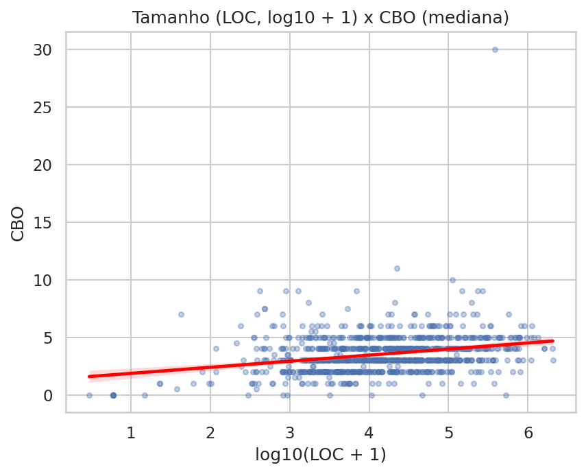
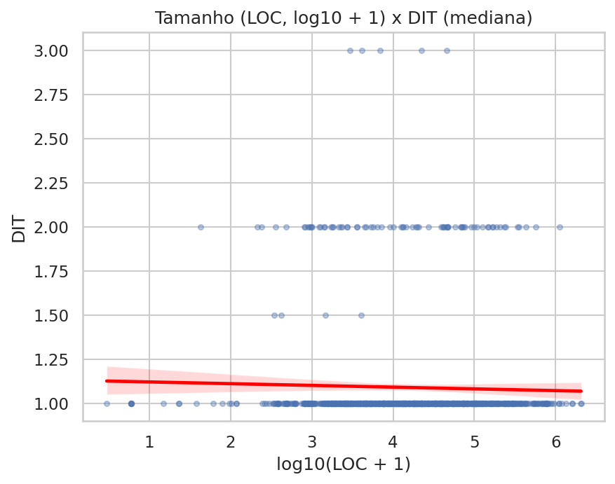
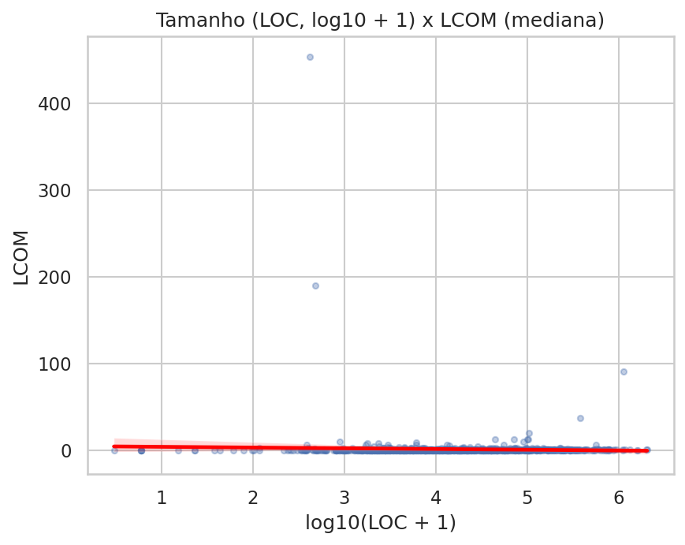

# RQ04 - Graficos e Tabela de Correlacao

## Correlacoes

| size_variable | metric | pearson | pearson_pvalue | spearman | spearman_pvalue | n |
| --- | --- | --- | --- | --- | --- | --- |
| LOC | cbo | 0.16165062346609707 | 4.773836277532099e-07 | 0.2942230593179433 | 1.2644703322517504e-20 | 960 |
| LOC | dit | -0.01865420632631543 | 0.5637525884825761 | -0.03720993541470042 | 0.24940142389862535 | 960 |
| LOC | lcom | 0.019703587775213437 | 0.5420226955889738 | 0.1587904200487786 | 7.61684057542433e-07 | 960 |
| COMMENT_LINES | cbo | nan | nan | nan | nan | 0 |
| COMMENT_LINES | dit | nan | nan | nan | nan | 0 |
| COMMENT_LINES | lcom | nan | nan | nan | nan | 0 |

## Graficos

### LOC_CBO

### LOC_DIT

### LOC_LCOM

